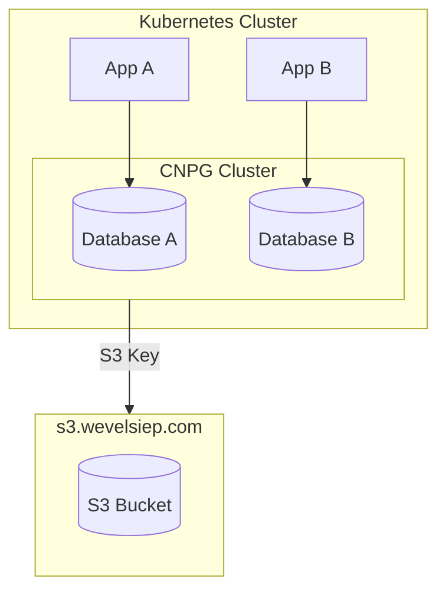
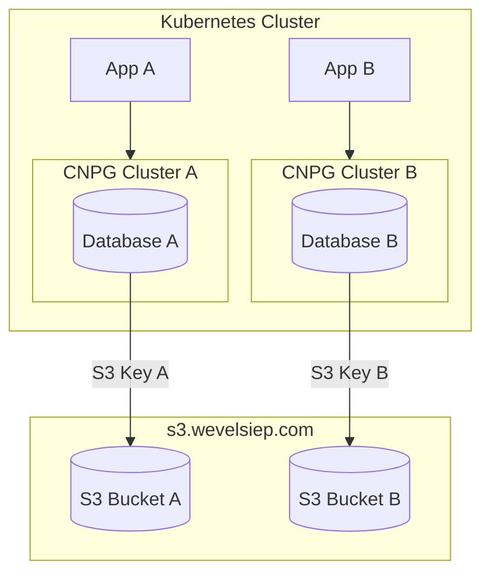

# The beginner mistake



In the beginning, I thought it was a good idea to run every database in a single massive CNPG cluster.
I noticed my mistake when I tried to test my backups: CNPG can only restore databases at the cluster level.
If I make a mistake in Database A, I would need to restore the entire cluster, affecting even databases that aren't impacted.

I checked the resource usage of the CNPG cluster:

```bash
NAME                        CPU(cores)   MEMORY(bytes)   
database-postgres-cluster-1   11m          84Mi    
```
At that moment, I realized that a single cluster for all apps was not ideal.
Instead, having one cluster per app would be safer and not that resource heavy. CNPG is really lightweight in that regard. 


# The refactor



During the refactor, I split the single S3 bucket into multiple buckets.

Now, each app gets its own CNPG cluster, S3 bucket and S3 key, making it possible to restore individual databases.  
Additionally, this provides separation between databases both at the cluster level and at the S3 bucket level, improving isolation and safety.

# Conclusion

I realized this issue during a backup test. In production, everything worked as expected.  

This experience once again shows me the importance of using and testing my setup.
If I hadn't caught this beforehand, I would have discovered it at a very bad time: when I *must* restore a backup, not when I *want* to.

# How to restore from a backup:

Make the following changes to the cluster.yaml
```yaml
apiVersion: postgresql.cnpg.io/v1
[...]
spec:
[...]

  bootstrap:
    recovery:
      source: s3-garage
      recoveryTarget:
        backupID: "20260409T000020"

  externalClusters:
    - name: s3-garage
      plugin:
        name: barman-cloud.cloudnative-pg.io
        parameters:
          barmanObjectName: s3-garage

  superuserSecret:
    name: postgres-superlogin
[...]
```
As you can see, we added spec.bootstrap and spec.externalClusters and removed spec.plugins.

The `backupID` can be found in your Garage/S3 bucket.

> **Note:** Remove `spec.bootstrap` again after the cluster has recovered successfully to prevent re-triggering recovery on the next reconcile.