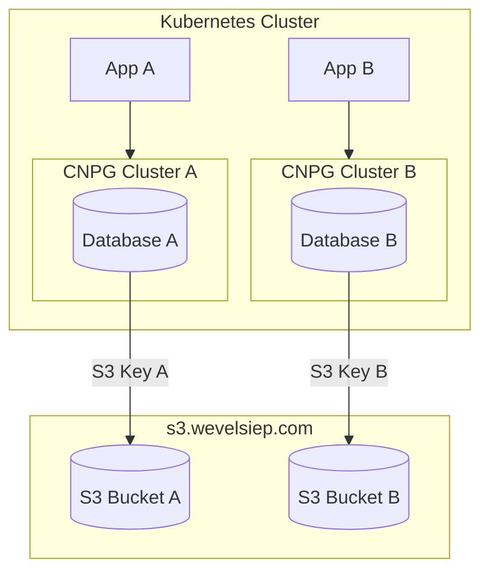

```mermaid
flowchart TB

%% Kubernetes
subgraph K8s["Kubernetes Cluster"]

    AppA["App A"]
    AppB["App B"]

    subgraph CNPGA["CNPG Cluster A"]
        DBA[(Database A)]
    end

    subgraph CNPGB["CNPG Cluster B"]
        DBB[(Database B)]
    end

end

%% Object Storage
subgraph S3["s3.wevelsiep.com"]
    BucketA[(S3 Bucket A)]
    BucketB[(S3 Bucket B)]
end

%% App -> Postgres Cluster
AppA --> CNPGA
AppB --> CNPGB

%% DB -> Backup Bucket
DBA -- S3 Key A --> BucketA
DBB -- S3 Key B --> BucketB
```
