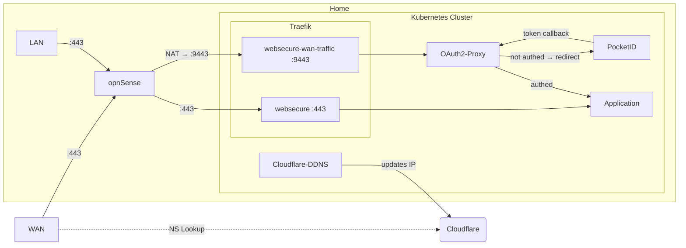

# The Facts

I get a public, but dynamic IPv4 address from my ISP. Normally I access my homelab over a WireGuard connection. This setup is tested and works, but after testing I disabled the port forward on my OPNsense because I have no reason to switch from WireGuard to an arguably larger attack surface.
This was just a fun little side project to explore the technical possibilities of WAN access without WireGuard.

# The Goal

I want to separate external and internal traffic to keep internal access easy for non technical users like my wife, while still using secure means to access my Kubernetes cluster from the outside.

# ToDo

- [ ] Implement mTLS
