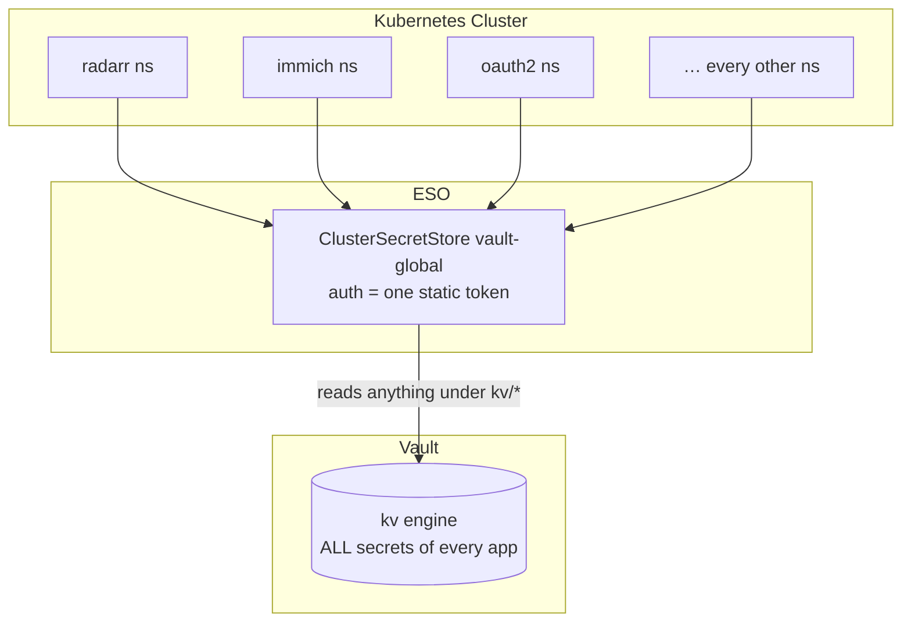
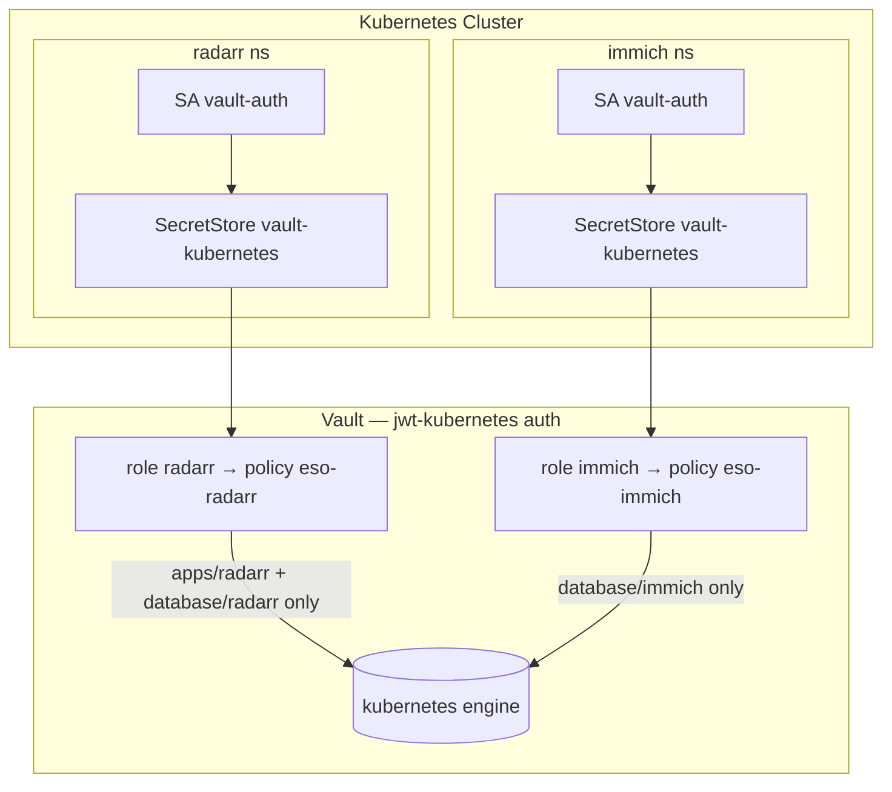

# Secrets

Every secret in this cluster lives in an external HashiCorp Vault and is pulled
into Kubernetes by the [External Secrets Operator](https://external-secrets.io)
(ESO). What changed over time is how ESO proves to Vault that it's allowed to
read a secret.

# One token for everything

In the beginning there was a single, cluster-wide store that every app pointed
at: a `ClusterSecretStore` backed by one Vault token.



```yaml
apiVersion: external-secrets.io/v1
kind: ClusterSecretStore
metadata:
  name: vault-global
spec:
  provider:
    vault:
      server: https://vault.wevelsiep.com
      path: kv
      version: v2
      auth:
        tokenSecretRef:
          name: vault-token
          key: token
          namespace: external-secrets
```

The token itself lived as a Bitnami SealedSecret (`vault-token` in the
`external-secrets` namespace). Every `ExternalSecret` in the whole cluster
referenced this one store, so every app authenticated with the same token.

It worked. Every app got its secrets.

# The problem

- Blast radius = the whole cluster. That one token can read every path in
  the `kv` engine. If it leaks — or if any single workload that can reach it is
  compromised — all secrets are exposed.
- No isolation / no least privilege. Nothing stops the `radarr` namespace
  from reading `immich`'s database credentials. The auth boundary is "the
  cluster", not "the namespace".
- A static, long-lived credential. The token doesn't expire on its own.
  Rotating it means re-sealing the SealedSecret and keeping it in sync with
  Vault by hand.

# The refactor: each namespace authenticates as itself

Instead of one shared token, every namespace now talks to Vault as its own
ServiceAccount and may read only its own paths.



Each namespace gets a `vault-auth` ServiceAccount and a namespaced
`SecretStore` (not a cluster-wide one):

```yaml
apiVersion: v1
kind: ServiceAccount
metadata:
  name: vault-auth
  namespace: radarr
---
apiVersion: external-secrets.io/v1
kind: SecretStore
metadata:
  name: vault-kubernetes
  namespace: radarr
spec:
  provider:
    vault:
      server: https://vault.wevelsiep.com
      path: kubernetes
      version: v2
      auth:
        jwt:
          path: jwt-kubernetes
          role: radarr
          kubernetesServiceAccountToken:
            serviceAccountRef:
              name: vault-auth
            audiences:
              - vault
            expirationSeconds: 600
```

What happens on each sync:

1. ESO asks Kubernetes for a short-lived (600s) projected token for the
   `vault-auth` ServiceAccount, with audience `vault`.
2. It logs in to Vault's `jwt-kubernetes` backend with that token.
3. Vault verifies the tokens signature against the Kubernetes API servers JWKS
   and checks the claims and issuer, `aud` (`vault`) and `sub`
   (`system:serviceaccount:radarr:vault-auth`).
4. On success Vault hands back a token carrying the `eso-radarr` policy, which
   allows reading only `radarr`'s paths.

# Access as code

The rules ("which namespace may read which paths") are not clicked into Vault by
hand. They live in a separate `vault-terraform` repo on my selfhosted gitea instance outside the cluster.

```hcl
namespace_paths = {
  radarr    = ["apps/radarr", "database/radarr"]
  radarr-db = ["database/radarr"]
}
```

Every entry generates, via Terraform:

- a read-only policy `eso-<ns>` on `kubernetes/data/<path>` and
  `kubernetes/metadata/<path>`, and
- a JWT role `<ns>` bound to `system:serviceaccount:<ns>:vault-auth`, granting
  that policy.

Terraform runs in CI (on a runner outside the cluster, so Vault stays
manageable even when the cluster is down) and authenticates to Vault with a
least privilege AppRole. So there's no longer a single token with access to the whole engine. Changes go through a pull
request, so a `terraform plan` shows exactly which access is added before it is
applied.

# Old vs. new

| | old (`vault-global`) | new (`vault-kubernetes`) |
| --- | --- | --- |
| Scope | one `ClusterSecretStore` | one `SecretStore` per namespace |
| Auth | single static token | per-namespace ServiceAccount (JWT) |
| Credential lifetime | long-lived | 600s |
| A namespace can read | every secret | only its own paths |
| Blast radius | whole cluster | one namespace |
| Access rules | implicit | code (`namespaces.auto.tfvars`), reviewed via PR |

# Onboarding a namespace

1. vault-terraform → add the namespace to `namespaces.auto.tfvars`:
   ```hcl
   radarr = ["apps/radarr", "database/radarr"]
   ```
   Merge → CI applies → the `radarr` role and `eso-radarr` policy exist in Vault.
2. App repo → add a `vault-auth` ServiceAccount and a `SecretStore
   vault-kubernetes` (with `role: radarr`) to the namespace and add both to
   the `kustomization.yaml`.
3. Point the namespace's `ExternalSecret`s at the new store:
   ```yaml
   secretStoreRef:
     name: vault-kubernetes
     kind: SecretStore
   ```

# Migration

The switch is gradual and non-breaking. The old `kv` engine was copied 1:1 into
a new `kubernetes` engine, so both run side by side. `vault-global` keeps serving
every namespace that hasn't moved yet, while migrated namespaces read from
`kubernetes`. Whisparr was the pilot (app + database namespace).

Once every namespace has its own `SecretStore`, the last cleanup step is to
remove `vault-global`, the `vault-token` SealedSecret and eventually the legacy
`kv` engine. If you see that `infrastructure-sealed-secrets.yaml` is no longer referenced in the `/cluster/kustomization.yaml` file the migration is over.  